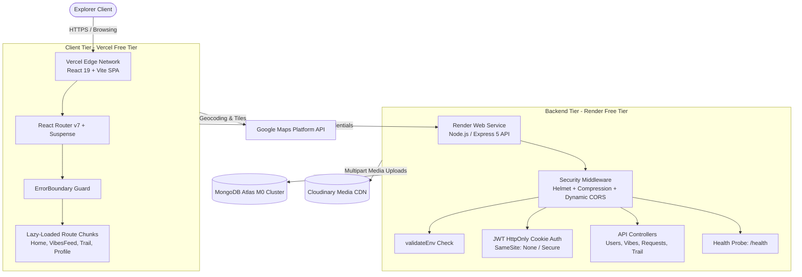

# Unplanned 🌲📍

> **Hyperlocal Spontaneous Micro-Adventures Platform**  
> Connect with like-minded explorers in your vicinity to spark instant, real-world activities and track your journey footprints.

[](https://www.typescriptlang.org/)
[](https://react.dev/)
[](https://vitejs.dev/)
[](https://nodejs.org/)
[](https://expressjs.com/)
[](https://www.mongodb.com/atlas)
[](https://vercel.com)

---

## 🧭 Overview

**Unplanned** is a full-stack MERN application engineered for discovering, creating, and joining spontaneous neighborhood events called **Sparks**, and chronicling completed journeys as **Footprints**. Built with a bespoke design system featuring glassmorphic accents, tailored typography (Outfit & Plus Jakarta Sans), and geospatial discovery powered by Google Maps Platform.

The application has undergone a comprehensive **production-readiness refactor** tailored specifically for a **100% free-tier cloud architecture** (**Vercel** + **Render** + **MongoDB Atlas** + **Cloudinary**), featuring route-level code splitting, proactive backend hardening, and zero-cost high availability.

---

## 🏗️ Architecture & Data Flow



---

## ⚡ Tech Stack

| Layer | Technologies |
| :--- | :--- |
| **Frontend** | React 19, TypeScript, Vite 8, React Router 7, Axios, Lucide React, Google Maps Platform (`@vis.gl/react-google-maps`) |
| **Backend** | Node.js, Express 5, Mongoose ODM, JWT (JSON Web Tokens), Cookie-Parser, Multer |
| **Hardening & Performance** | `helmet` (HTTP headers), `compression` (Gzip/Brotli), `React.lazy()` + `<Suspense>`, `ErrorBoundary` |
| **Database & Media** | MongoDB Atlas (M0 Free Replica Set), Cloudinary API (Default & User Media Storage) |
| **Hosting Infrastructure** | **Frontend**: Vercel Edge CDN & SPA Rewrites<br>**Backend**: Render Web Service (Free Tier with Keep-Warm Health Probes) |

---

## 🚀 Scalability & Performance Highlights (Recruiter & Portfolio Showcase)

This codebase demonstrates production-grade engineering principles designed to maximize throughput, minimize latency, and operate within strict free-tier memory and bandwidth budgets:

### 1. Route-Level Code-Splitting & Dynamic Bundling
- Implemented `React.lazy()` and `<Suspense>` with a custom animated `RouteLoadingFallback` across all 8 major views (`Home`, `VibesFeed`, `VibeDetails`, `VibeCreate`, `Trail`, `Profile`, `Login`, `Register`).
- Heavy external dependencies (e.g. Google Maps API and geocoding controls in `VibeDetails`) are isolated into dynamic split chunks (`63.45 kB`), keeping the initial landing page bundle ultra-compact (~`6.5 kB` route chunk) for sub-second Largest Contentful Paint (LCP).
- Configured Vercel HTTP headers for `public, max-age=31536000, immutable` on hashed assets in `/assets/(.*)`.

### 2. Runtime Error Boundary Isolation
- Integrated a class-based `<ErrorBoundary>` that intercepts unhandled render exceptions, displays a branded recovery state, and exposes a single-click reconnect action (`Try Reconnecting`) or fallback navigation (`Return to Basecamp`).
- Prevents catastrophic blank white-screens if network timeouts or third-party APIs fail.

### 3. Fail-Fast Configuration & Startup Diagnostics
- Implemented `validateEnv()` in `Backend/config/validateEnv.js` which verifies critical secrets (`MONGO_URI`, `JWT_SECRET`, `CLOUDINARY_*`) synchronously on boot.
- Prevents downstream runtime panics or silent partial initialization by halting immediately with human-readable guidance if required environment variables are absent.

### 4. Enterprise-Grade Security & Wire Optimization
- **HTTP Hardening via Helmet**: Applies HTTP Strict Transport Security (`HSTS`), Content Security Policy (`CSP`), `X-Frame-Options: SAMEORIGIN` (Clickjacking protection), and `X-Content-Type-Options: nosniff` (MIME sniffing prevention).
- **Payload Compression**: Native `compression()` middleware compresses outgoing JSON payloads with Gzip, minimizing network payload overhead over free-tier bandwidth caps.
- **Dynamic CORS Origin Sanitization**: Whitelists production domains, preview PR branches on `*.vercel.app`, and local development ports while disallowing untrusted origins.

### 5. Seamless Decoupled Cross-Origin Authentication
- When hosting frontend (`*.vercel.app`) and backend (`*.onrender.com`) on separate top-level domains, default browser cookie security blocks third-party cookies.
- Solved by implementing an environment-aware cookie utility in `Backend/controllers/userController.js`:
  ```javascript
  const getAuthCookieOptions = () => ({
    maxAge: 24 * 60 * 60 * 1000, // 1 day
    httpOnly: true,
    sameSite: process.env.NODE_ENV === "production" ? "none" : "lax",
    secure: process.env.NODE_ENV === "production",
  });
  ```
  This preserves seamless CSRF protection locally while enabling authenticated HTTP-only sessions across separate HTTPS origins in production.

### 6. Zero-Cost Cold-Start Mitigation for Free Containers
- Render free-tier containers spin down after 15 minutes of inactivity. Added a lightweight `GET /health` probe returning memory uptime and environment status.
- Enables free external ping monitors (e.g., UptimeRobot or Cron-job.org) to keep the container warm during active hours at $0 total operational cost.

---

## 📁 Repository Structure

```
Unplanned/
├── Backend/                      # Node.js & Express API Service
│   ├── config/
│   │   ├── db.js                 # Mongoose connection logic
│   │   ├── multer.js             # Cloudinary storage engine
│   │   └── validateEnv.js        # Fail-fast environment validator
│   ├── controllers/              # Business logic & Route handlers
│   │   ├── userController.js     # Auth, session cookies, profiles
│   │   ├── vibeController.js     # Sparks creation & lifecycle
│   │   ├── requestController.js  # Participation workflows
│   │   └── trailController.js    # Expeditions & history
│   ├── models/                   # Mongoose schemas (User, Vibe, Request)
│   ├── routes/                   # Express route definitions
│   ├── .env.example              # Server environment template
│   ├── .npmrc                    # Automated peer-dependency resolution
│   ├── app.js                    # Express app, middleware & server entry
│   └── package.json
│
├── Frontend/unplanned/           # React 19 + TypeScript + Vite SPA
│   ├── src/
│   │   ├── api/                  # Axios instance with credentials
│   │   ├── components/           # Reusable UI & Layout components
│   │   │   ├── ErrorBoundary.tsx # Route runtime crash barrier
│   │   │   ├── RouteLoadingFallback.tsx # Ambient Suspense loader
│   │   │   ├── Navbar.tsx        # Navigation with active-tab scroll
│   │   │   ├── Footer.tsx        # Streamlined 2-column footer
│   │   │   └── ProtectedRoute.tsx# Auth state redirection guard
│   │   ├── context/              # Auth & Toast state providers
│   │   ├── pages/                # Route-level views (Lazy loaded)
│   │   │   ├── Home.tsx          # Hero, radar teaser, pillars
│   │   │   ├── VibesFeed.tsx     # Exploration discovery feed
│   │   │   ├── VibeDetails.tsx   # Spark hub, attendees, map
│   │   │   ├── VibeCreate.tsx    # Spark publishing studio
│   │   │   ├── Trail.tsx         # User's Sparks & Footprints
│   │   │   ├── Profile.tsx       # Explorer dossier & settings
│   │   │   ├── Login.tsx         # Credentials entry
│   │   │   └── Register.tsx      # Account creation
│   │   ├── App.tsx               # App shell & lazy route declarations
│   │   └── index.css             # Design tokens & global CSS
│   ├── vercel.json               # SPA rewrites & Edge caching rules
│   ├── .env.example              # Client environment template
│   └── package.json
│
├── CHANGELOG_PRODUCTION.md       # Technical audit of production refactor
└── README.md                     # Project documentation & setup guide
```

---

## 🛠️ Step-by-Step Local Setup

### Prerequisites
- **Node.js**: v18.0.0 or higher
- **npm**: v9.0.0 or higher
- **MongoDB Atlas** account (or local MongoDB daemon)
- **Cloudinary** account (free tier)
- **Google Maps API Key** (with Maps JavaScript API enabled)

---

### 1. Clone & Navigate
```bash
git clone https://github.com/your-username/Unplanned.git
cd Unplanned
```

---

### 2. Backend Setup
1. Navigate into the Backend directory:
   ```bash
   cd Backend
   ```
2. Install dependencies:
   ```bash
   npm install
   ```
3. Create your `.env` configuration file:
   ```bash
   cp .env.example .env
   ```
4. Fill in your credentials inside `Backend/.env`:
   ```env
   PORT=3000
   NODE_ENV=development
   MONGO_URI=mongodb+srv://<username>:<password>@cluster0.wtqpoth.mongodb.net/unplanned?retryWrites=true&w=majority
   JWT_SECRET=your_super_secret_jwt_key
   CLIENT_URL=http://localhost:5173
   CLOUDINARY_CLOUD_NAME=your_cloud_name
   CLOUDINARY_API_KEY=your_api_key
   CLOUDINARY_API_SECRET=your_api_secret
   ```
5. Start the backend development server:
   ```bash
   npm run dev
   # Server runs at http://localhost:3000
   ```
6. Verify the server is running by opening:
   ```
   http://localhost:3000/health
   ```
   *(Expected response: `{"status":"healthy","uptime":...}`)*

---

### 3. Frontend Setup
1. Open a new terminal and navigate to the frontend directory:
   ```bash
   cd Frontend/unplanned
   ```
2. Install dependencies:
   ```bash
   npm install
   ```
3. Create your `.env` configuration file:
   ```bash
   cp .env.example .env
   ```
4. Configure your client keys in `Frontend/unplanned/.env`:
   ```env
   VITE_API_URL=http://localhost:3000/api
   VITE_GOOGLE_MAPS_API_KEY=your_google_maps_api_key_here
   ```
5. Start the Vite dev server:
   ```bash
   npm run dev
   # App runs at http://localhost:5173
   ```
6. Verify production build and TypeScript compilation:
   ```bash
   npm run build
   ```

---

## 🌐 100% Free Tier Deployment Guide

### A. Database (MongoDB Atlas Free M0)
1. Create a free shared cluster (`M0`) on [MongoDB Atlas](https://www.mongodb.com/atlas).
2. Under **Network Access**, add `0.0.0.0/0` (allow access from anywhere) so Render containers can connect dynamically.
3. Under **Database Access**, create a user with read/write permissions.
4. Copy the connection string into your Render environment variables as `MONGO_URI`.

### B. Backend Web Service (Render Free Tier)
1. Sign up on [Render.com](https://render.com) and click **New > Web Service**.
2. Connect your Git repository and configure:
   - **Root Directory**: `Backend`
   - **Environment**: `Node`
   - **Build Command**: `npm install`
   - **Start Command**: `npm start`
   - **Instance Type**: `Free`
3. In **Environment Variables**, add:
   - `NODE_ENV` = `production`
   - `MONGO_URI` = *(Your MongoDB Atlas connection URI)*
   - `JWT_SECRET` = *(Your secure random token string)*
   - `CLIENT_URL` = `https://<your-vercel-domain>.vercel.app`
   - `CLOUDINARY_CLOUD_NAME` = *(Your Cloudinary cloud name)*
   - `CLOUDINARY_API_KEY` = *(Your Cloudinary API key)*
   - `CLOUDINARY_API_SECRET` = *(Your Cloudinary API secret)*
4. Deploy the service and note your Render URL (e.g. `https://unplanned-api.onrender.com`).
5. *(Optional Keep-Warm)*: Add `https://<your-render-app>.onrender.com/health` to [UptimeRobot](https://uptimerobot.com) with a 14-minute interval to prevent container cold starts.

### C. Frontend Single-Page App (Vercel Free Tier)
1. Sign up on [Vercel.com](https://vercel.com) and click **Add New > Project**.
2. Connect your repository and configure:
   - **Root Directory**: `Frontend/unplanned`
   - **Framework Preset**: `Vite`
   - **Build Command**: `npm run build`
   - **Output Directory**: `dist`
3. In **Environment Variables**, add:
   - `VITE_API_URL` = `https://<your-render-app>.onrender.com/api`
   - `VITE_GOOGLE_MAPS_API_KEY` = *(Your Google Maps API key)*
4. Click **Deploy**. Vercel will build the React bundle and deploy it across its global edge network.
5. In your Render service, ensure `CLIENT_URL` matches your exact Vercel production URL.

---

## 🧪 Verification & Health Checks

- **Frontend Bundle Validation**:
  ```bash
  cd Frontend/unplanned && npm run build
  ```
  *Ensures zero TypeScript errors (`tsc -b`) and validates that Vite produces distinct lazy-loaded chunks for each route.*

- **Backend Health Check**:
  ```bash
  curl -i http://localhost:3000/health
  ```
  *Returns `HTTP/1.1 200 OK` with Helmet security headers (`X-Content-Type-Options: nosniff`, `Strict-Transport-Security`, `Content-Security-Policy`).*

---

## 📄 License

This project is licensed under the MIT License - see the LICENSE file for details.
